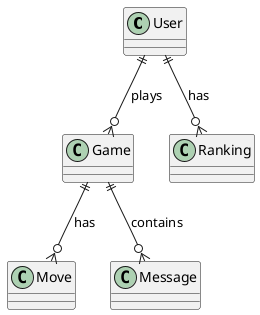

# Caro Online Project

## 1. Project Overview

Caro Online là một game cờ caro (Gomoku) trực tuyến với đầy đủ tính năng, được xây dựng với kiến trúc hiện đại. Game hỗ trợ chơi với AI (PvE) ở 3 mức độ khó khác nhau và chơi với người khác (PvP) qua hệ thống lobby và phòng chơi.

### Key Features

- **PvE (Player vs Environment)**: Chơi với AI ở 3 mức độ (Easy, Medium, Hard)
- **PvP (Player vs Player)**: Chơi với người khác qua hệ thống lobby, tạo phòng, mời người chơi
- **AI Engine**: AI thông minh với Minimax, Alpha-Beta pruning, và heuristic scoring
- **Leaderboard**: Bảng xếp hạng theo ngày/tuần/tháng/năm
- **Game History**: Lịch sử các trận đấu đã chơi
- **Real-time Chat**: Chat trong game với SignalR
- **Countdown Timer**: Đếm ngược thời gian cho mỗi lượt
- **Options**: Tùy chỉnh thời gian lượt, theme, âm thanh, animation

### Target Platforms

- **Web**: Responsive design, tối ưu cho desktop và mobile browsers
- **Future**: Có thể mở rộng cho Desktop (Electron) và Mobile (PWA)

## 2. Features

### PVE (Player vs Environment)

#### Choose Difficulty
- **Easy (IQ 150)**: Threat map + heuristic, depth 1-2
  - Ưu tiên: Win → Block → Threat
  - Người chơi casual vẫn có thể thắng
- **Medium (IQ 200)**: Advanced heuristic + combo strategies, depth 2-3
  - Ưu tiên: Win → Block high-threat → Create multiple threats
  - Kiểm soát trung tâm bàn cờ
- **Hard (IQ 400)**: Minimax với Alpha-Beta pruning, depth 3-4
  - Weighted scoring system
  - Ưu tiên: Win → Block → Create 2 threats → Optimize control
  - Rất khó để đánh bại

#### Board Component
- **Highlight AI Move**: Highlight nước đi của AI với animation pulse
- **Player Turn Countdown**: Đếm ngược thời gian cho lượt của người chơi
- **Move Animation**: Scale-in animation khi đặt quân
- **Win Detection**: Tự động phát hiện thắng thua và hiển thị kết quả

### PvP (Player vs Player)

#### Login Check
- Nếu chưa đăng nhập, tự động redirect đến trang Login
- Yêu cầu authentication để truy cập PvP section

#### Lobby

##### Create Room
- **Add Players**: 
  - Xem danh sách người online
  - Mời người chơi từ danh sách
  - Gửi challenge với countdown (10 giây)
- **Show Online Users**: 
  - Hiển thị số người đang online
  - Danh sách người chơi có sẵn để mời
- **Invite / Accept**:
  - Gửi lời mời với countdown timer
  - Hiển thị spinner khi đang chờ phản hồi
  - Notification khi được mời
- **Kick Player**: 
  - Chủ phòng có thể kick người chơi khác
  - Chỉ chủ phòng mới có quyền kick

##### Join Existing Room
- **Select Room**: 
  - Xem danh sách phòng có sẵn
  - Filter phòng đang chờ người chơi
  - Hiển thị thông tin phòng (chủ phòng, số người, thời gian)
- **Wait for Owner Accept**: 
  - Gửi join request đến chủ phòng
  - Countdown 8 giây khi đợi chủ phòng đồng ý
  - Spinner hiển thị trạng thái đang chờ
  - Thông báo khi được đồng ý/từ chối/timeout

#### Board PvP
- **Highlight Current Move**: Highlight nước đi vừa thực hiện
- **Countdown Per Turn**: Đếm ngược thời gian cho mỗi lượt (realtime)
- **Realtime Chat**: 
  - Chat trong game với SignalR
  - Hiển thị timestamp và người gửi
  - Auto-scroll đến tin nhắn mới nhất
- **Animation of Moves**: 
  - Scale-in animation khi đặt quân
  - Smooth transitions
  - Pulse effect cho highlighted moves

### Ranking

- **Tabs**: Daily / Weekly / Monthly / Yearly
- **Leaderboard Table**: 
  - Hiển thị rank, username, điểm số
  - Sort theo điểm số
  - Pagination (nếu cần)
- **TODO**: Thêm filter theo mode (PvP/PvE)

### History

- **List of Past Matches**: 
  - Hiển thị danh sách các trận đấu đã chơi
  - Thông tin: Mode, đối thủ, kết quả, thời gian
  - Filter theo mode (PvP/PvE)
- **TODO**: Thêm chi tiết từng trận (xem lại nước đi)

### Options

- **Turn Time Settings**: 
  - Đặt thời gian tối đa cho mỗi lượt (30-600 giây)
  - Áp dụng cho game mới
- **Board/Theme Selection**: 
  - Chọn theme cho bàn cờ
  - Preview theme
- **Toggle Sound & Animations**: 
  - Bật/tắt âm thanh
  - Bật/tắt hiệu ứng animation
  - Lưu cài đặt vào localStorage

## 3. Technologies Used

### Backend
- **C# 12+**: Programming language
- **ASP.NET Core 8**: Web API framework
- **SignalR**: Real-time communication
- **Entity Framework Core**: ORM cho database operations
- **SQL Server**: Relational database
- **JWT Authentication**: Token-based authentication
- **BCrypt**: Password hashing

### Frontend
- **Vue 3**: Progressive JavaScript framework
- **TypeScript**: Type-safe JavaScript
- **Vite**: Build tool và dev server
- **TailwindCSS**: Utility-first CSS framework
- **Pinia**: State management
- **Vue Router**: Client-side routing
- **Axios**: HTTP client
- **@microsoft/signalr**: SignalR client library

### AI
- **Easy Logic**: Threat map + heuristic scoring
- **Medium Logic**: Advanced heuristic + combo strategies
- **Hard Logic**: Minimax algorithm với Alpha-Beta pruning

### Others
- **JWT Authentication**: Secure token-based auth
- **Countdown Timer**: Real-time timer với SignalR
- **Animation Libraries**: CSS transitions và TailwindCSS animations

## 4. Folder Structure

```
CaroOnline/
├── backend/
│   └── src/
│       ├── Caro.Api/              # Web API & SignalR Hub
│       │   ├── Controllers/        # REST API controllers
│       │   │   ├── AuthController.cs
│       │   │   ├── GamesController.cs
│       │   │   └── UsersController.cs
│       │   ├── Hubs/              # SignalR hubs
│       │   │   └── GameHub.cs
│       │   ├── Services/           # Background services
│       │   │   ├── ChallengeService.cs
│       │   │   ├── GameTimerService.cs
│       │   │   └── PresenceService.cs
│       │   ├── Program.cs
│       │   └── appsettings.json
│       ├── Caro.Core/              # Domain entities
│       │   └── Entities/
│       │       ├── Game.cs
│       │       ├── Move.cs
│       │       ├── User.cs
│       │       ├── Message.cs
│       │       ├── Ranking.cs
│       │       └── GameHistory.cs
│       ├── Caro.Infrastructure/    # DbContext & EF Core
│       │   └── CaroDbContext.cs
│       └── Caro.Services/          # Business logic
│           ├── AiService.cs
│           ├── AuthService.cs
│           ├── GameService.cs
│           └── Interfaces/
│               ├── IAiService.cs
│               ├── IAuthService.cs
│               └── IGameService.cs
├── frontend/
│   └── src/
│       ├── components/             # Vue components
│       │   ├── Board.vue
│       │   ├── Cell.vue
│       │   ├── Chatbox.vue
│       │   ├── Countdown.vue
│       │   ├── CreateRoom.vue
│       │   ├── DifficultySelect.vue
│       │   ├── Lobby.vue
│       │   ├── LoginPrompt.vue
│       │   ├── Navbar.vue
│       │   ├── Notification.vue
│       │   ├── PlayerList.vue
│       │   ├── RoomView.vue
│       │   ├── SoundToggle.vue
│       │   ├── Spinner.vue
│       │   ├── ThemeSelect.vue
│       │   └── TimeSelect.vue
│       ├── pages/                  # Page components
│       │   ├── HistoryPage.vue
│       │   ├── LoginPage.vue
│       │   ├── MenuPage.vue
│       │   ├── OptionsPage.vue
│       │   ├── PVEPage.vue
│       │   ├── PVPPage.vue
│       │   ├── RankingPage.vue
│       │   └── RegisterPage.vue
│       ├── stores/                 # Pinia stores
│       │   ├── auth.ts
│       │   ├── game.ts
│       │   ├── lobby.ts
│       │   └── signalr.ts
│       ├── services/               # API & SignalR services
│       │   ├── api.ts
│       │   └── signalr.ts
│       ├── router/                 # Vue Router config
│       │   └── index.ts
│       ├── App.vue
│       ├── main.ts
│       └── index.css
└── sql/
    └── init_schema.sql             # Database schema
```

## 5. Installation & Setup

### Prerequisites

- **.NET 8 SDK**: [Download](https://dotnet.microsoft.com/download/dotnet/8.0)
- **Node.js 18+**: [Download](https://nodejs.org/)
- **SQL Server**: SQL Server 2019+ hoặc SQL Server Express
- **Visual Studio Code** (optional): Recommended IDE

### Backend Setup

1. **Clone repository** (nếu có)
   ```bash
   git clone <repository-url>
   cd CaroOnline
   ```

2. **Configure Database Connection**
   
   Update connection string trong `backend/src/Caro.Api/appsettings.json`:
   ```json
   {
     "ConnectionStrings": {
       "DefaultConnection": "Server=YOUR_SERVER;Database=CaroDb;User Id=sa;Password=YOUR_PASSWORD;TrustServerCertificate=True;"
     }
   }
   ```

3. **Initialize Database**
   
   Chạy SQL script để tạo database và tables:
   ```bash
   sqlcmd -S YOUR_SERVER -U sa -P YOUR_PASSWORD -i sql/init_schema.sql
   ```
   
   Hoặc sử dụng SQL Server Management Studio (SSMS) để chạy script.

4. **Restore Dependencies**
   ```bash
   cd backend/src/Caro.Api
   dotnet restore
   ```

5. **Run Backend**
   ```bash
   dotnet run
   ```
   
   Backend sẽ chạy tại:
   - API: http://localhost:8080
   - Swagger: http://localhost:8080/swagger (Development only)
   - SignalR Hub: http://localhost:8080/hub/game

### Frontend Setup

1. **Install Dependencies**
   ```bash
   cd frontend
   npm install
   ```

2. **Configure API Endpoint** (nếu cần)
   
   Update API base URL trong `frontend/src/services/api.ts` nếu backend chạy ở port khác.

3. **Run Development Server**
   ```bash
   npm run dev
   ```
   
   Frontend sẽ chạy tại:
   - http://localhost (default port 80)
   - Hoặc http://localhost:5173 (Vite default)

4. **Build for Production**
   ```bash
   npm run build
   ```
   
   Output sẽ ở trong `frontend/dist/`

### Database Setup

#### Initial Schema

Chạy `sql/init_schema.sql` để tạo:
- Database `CaroDb`
- Tables: Users, Games, Moves, Messages, Rankings, GameHistory
- Indexes và constraints

#### Migration (nếu database đã tồn tại)

Nếu database đã có nhưng thiếu cột `Email` trong bảng `Users`, chạy:
```sql
-- Thêm cột Email nếu chưa có
IF NOT EXISTS (SELECT * FROM sys.columns WHERE object_id = OBJECT_ID('Users') AND name = 'Email')
BEGIN
    ALTER TABLE Users ADD Email NVARCHAR(255) NULL;
    UPDATE Users SET Email = 'user' + CAST(Id AS NVARCHAR) + '@example.com' WHERE Email IS NULL;
    ALTER TABLE Users ALTER COLUMN Email NVARCHAR(255) NOT NULL;
    CREATE UNIQUE INDEX IX_Users_Email ON Users(Email);
END
```

### Running Locally

1. **Start Backend** (Terminal 1)
   ```bash
   cd backend/src/Caro.Api
   dotnet run
   ```

2. **Start Frontend** (Terminal 2)
   ```bash
   cd frontend
   npm run dev
   ```

3. **Open Browser**
   - Navigate to http://localhost
   - Hoặc http://localhost:5173

## 6. Usage

### How to Start Backend

```bash
cd backend/src/Caro.Api
dotnet restore
dotnet run
```

Backend sẽ tự động:
- Load connection string từ `appsettings.json`
- Connect đến SQL Server
- Start API server trên port 8080
- Enable Swagger UI (Development mode)

### How to Start Frontend

```bash
cd frontend
npm install  # Chỉ cần chạy lần đầu
npm run dev
```

Frontend sẽ:
- Start Vite dev server
- Hot reload khi có thay đổi code
- Connect đến backend API tại http://localhost:8080

### Login / Register

1. **Register New Account**
   - Navigate to `/register`
   - Điền thông tin: Username, Email, Password, Confirm Password
   - Click "Đăng ký"
   - Tự động redirect đến Login page

2. **Login**
   - Navigate to `/login`
   - Điền Username/Email và Password
   - Click "Đăng nhập"
   - Token được lưu vào localStorage
   - Redirect đến Menu page

### Play PvP

1. **Access PvP Section**
   - Click "PVP" từ Menu page
   - Nếu chưa đăng nhập, redirect đến Login page

2. **Create Room**
   - Click "Tạo phòng"
   - Nhập thời gian lượt (30-600 giây)
   - Click "Tạo phòng"
   - Hiển thị RoomView với danh sách người online

3. **Invite Player**
   - Chọn người từ danh sách online
   - Click "Mời"
   - Người được mời nhận notification
   - Nếu đồng ý → Cả 2 vào bàn cờ

4. **Join Existing Room**
   - Click "Vào phòng"
   - Xem danh sách phòng có sẵn
   - Chọn phòng → Click "Vào phòng"
   - Đợi chủ phòng đồng ý (countdown 8 giây)
   - Nếu đồng ý → Vào bàn cờ

5. **Play Game**
   - Click vào ô trống để đặt quân
   - Đợi đối thủ đánh
   - Chat trong game (sidebar)
   - Xem countdown timer
   - Game kết thúc khi có người thắng hoặc đầu hàng

### Play PVE

1. **Access PVE Section**
   - Click "PVE" từ Menu page
   - Không cần đăng nhập

2. **Select Difficulty**
   - Chọn độ khó: Easy / Medium / Hard
   - Click "Bắt đầu"

3. **Play Game**
   - Click vào ô trống để đặt quân
   - AI tự động đánh sau lượt của bạn
   - AI move được highlight
   - Game kết thúc khi có người thắng

### Options and Settings

1. **Access Options**
   - Click "Options" từ Menu page

2. **Configure Settings**
   - **Turn Time**: Chọn thời gian tối đa cho mỗi lượt (30-600s)
   - **Theme**: Chọn theme cho bàn cờ
   - **Sound**: Toggle âm thanh on/off
   - **Animation**: Toggle animation on/off

3. **Save Settings**
   - Click "Lưu cài đặt"
   - Settings được lưu vào localStorage
   - Áp dụng cho game mới

## 7. AI Logic

### Description of Easy / Medium / Hard AI

#### Easy (IQ 150)
- **Algorithm**: Threat map + heuristic scoring
- **Depth**: 1-2 moves lookahead
- **Priority**:
  1. Win immediately (4 consecutive AI pieces open)
  2. Block opponent (3-4 consecutive pieces)
  3. Select move with highest threat map score
- **Difficulty**: Casual players can still win

#### Medium (IQ 200)
- **Algorithm**: Advanced heuristic + combo strategies
- **Depth**: 2-3 moves lookahead
- **Priority**:
  1. Win immediately if possible
  2. Block opponent's high-threat moves
  3. Create multiple threats simultaneously
  4. Control board center / strategic positions
- **Difficulty**: Moderate challenge

#### Hard (IQ 400)
- **Algorithm**: Minimax với Alpha-Beta pruning
- **Depth**: 3-4 moves lookahead
- **Weighted Scoring**:
  - 5 in a row: +1000 (auto-win)
  - 4 in a row open 2 ends: +500 (auto-win)
  - Block opponent 4 in a row: +400
  - Block opponent 3 in a row: +80
  - Create 2 threats simultaneously: +200
  - Other threats: +10-50
- **Priority**:
  1. Win immediately
  2. Block opponent winning move
  3. Create multiple threats
  4. Optimize board control
- **Difficulty**: Very difficult to beat

### Win Condition Check

#### 5 in a Row
- Kiểm tra 4 hướng: ngang, dọc, chéo trái, chéo phải
- Nếu có 5 quân liên tiếp → Thắng ngay

#### 4 Open Ends (2 đầu trống)
- Kiểm tra pattern: `_XXXX_` (4 quân với 2 đầu trống)
- Nếu tìm thấy → Thắng ngay

#### Block Two Ends
- Phát hiện khi đối thủ có 4 quân với 2 đầu trống
- Block một trong 2 đầu → Chiến thắng phòng thủ

### Threat Detection

- **Threat Map**: Đánh giá mức độ nguy hiểm của từng ô
- **Pattern Recognition**: 
  - 4 consecutive (open 1 end)
  - 3 consecutive (open 2 ends)
  - 2 consecutive (potential threat)
- **Double Threat**: Tạo 2 threats cùng lúc để đối thủ không thể block hết

## 8. Screenshots / Flowcharts / PlantUML

### TODO: Screenshots

#### Board Screenshot
- [ ] Screenshot của bàn cờ 15x15
- [ ] Highlight nước đi cuối cùng
- [ ] Countdown timer hiển thị

#### Lobby Screenshot
- [ ] Screenshot của lobby với danh sách phòng
- [ ] RoomView với join requests
- [ ] Online users list

#### Game Flow Screenshot
- [ ] PVE game với AI move highlight
- [ ] PVP game với chat và countdown

### TODO: Flowcharts

#### AI Decision Flow
```
[Start] → [Check Win Move] → [Win Found?] → [Yes: Play Win Move]
                                              [No: Check Block Move]
                                              → [Block Found?] → [Yes: Play Block]
                                                                  [No: Evaluate Threats]
                                                                  → [Select Best Move]
```

#### PvP Room Flow
```
[User] → [Create Room] → [Room Created] → [Show Online Users]
                                              ↓
                                    [Invite Player] → [Send Challenge]
                                              ↓
                                    [Accept Challenge] → [Start Game]
```

#### Join Request Flow
```
[User] → [Select Room] → [Send Join Request] → [Owner Receives Request]
                                                      ↓
                                            [Owner Accept/Reject]
                                                      ↓
                                            [If Accept: Join Room]
                                            [If Reject: Notify User]
```

### TODO: PlantUML Diagrams

#### SignalR PvP Architecture
```plantuml
@startuml
Client -> SignalR Hub: Connect
SignalR Hub -> Client: Connected
Client -> SignalR Hub: CreateGame
SignalR Hub -> Database: Save Game
SignalR Hub -> Client: GameStarted
Client -> SignalR Hub: MakeMove
SignalR Hub -> Database: Save Move
SignalR Hub -> All Clients: MoveMade
@enduml
```

#### Database Schema


## 9. Contributing

### How to Contribute / Add New Features

1. **Fork Repository** (nếu có GitHub repo)
2. **Create Feature Branch**
   ```bash
   git checkout -b feature/your-feature-name
   ```
3. **Make Changes**
   - Follow code style guide
   - Add comments for complex logic
   - Update tests if applicable
4. **Commit Changes**
   ```bash
   git commit -m "Add: Description of your feature"
   ```
5. **Push to Branch**
   ```bash
   git push origin feature/your-feature-name
   ```
6. **Create Pull Request**
   - Describe changes
   - Link related issues
   - Request review

### Code Style Guide

#### Backend (C#)
- Use PascalCase for classes, methods, properties
- Use camelCase for local variables
- Use meaningful names
- Add XML comments for public methods
- Follow ASP.NET Core conventions

#### Frontend (Vue 3 + TypeScript)
- Use PascalCase for components
- Use camelCase for variables and functions
- Use `<script setup lang="ts">` syntax
- Use Composition API
- Add JSDoc comments for complex functions

### Branching Strategy

- **main**: Production-ready code
- **develop**: Development branch
- **feature/**: New features
- **bugfix/**: Bug fixes
- **hotfix/**: Urgent fixes

## 10. Authors & Contact

### Team Members

- **TODO**: Thêm tên team members
- **TODO**: Thêm roles (Backend Developer, Frontend Developer, etc.)

### Roles

- **Backend Development**: ASP.NET Core, SignalR, Entity Framework
- **Frontend Development**: Vue 3, TypeScript, TailwindCSS
- **AI Development**: Minimax, Heuristic algorithms
- **Database Design**: SQL Server schema design

### Contact Info

- **TODO**: Thêm email, GitHub, LinkedIn, etc.

## 11. License

This project is licensed under the **MIT License**.

```
MIT License

Copyright (c) 2024 Caro Online Project

Permission is hereby granted, free of charge, to any person obtaining a copy
of this software and associated documentation files (the "Software"), to deal
in the Software without restriction, including without limitation the rights
to use, copy, modify, merge, publish, distribute, sublicense, and/or sell
copies of the Software, and to permit persons to whom the Software is
furnished to do so, subject to the following conditions:

The above copyright notice and this permission notice shall be included in all
copies or substantial portions of the Software.

THE SOFTWARE IS PROVIDED "AS IS", WITHOUT WARRANTY OF ANY KIND, EXPRESS OR
IMPLIED, INCLUDING BUT NOT LIMITED TO THE WARRANTIES OF MERCHANTABILITY,
FITNESS FOR A PARTICULAR PURPOSE AND NONINFRINGEMENT. IN NO EVENT SHALL THE
AUTHORS OR COPYRIGHT HOLDERS BE LIABLE FOR ANY CLAIM, DAMAGES OR OTHER
LIABILITY, WHETHER IN AN ACTION OF CONTRACT, TORT OR OTHERWISE, ARISING FROM,
OUT OF OR IN CONNECTION WITH THE SOFTWARE OR THE USE OR OTHER DEALINGS IN THE
SOFTWARE.
```

---

## Additional Notes

### Development Notes

- Backend chạy trên port **8080**
- Frontend chạy trên port **80** (hoặc 5173 nếu dùng Vite default)
- Database migration: Chạy `sql/init_schema.sql` để tạo schema
- SignalR requires credentials, nên CORS phải chỉ định origins cụ thể (không dùng wildcard)
- JWT token được lưu trong localStorage (frontend)
- Password được hash bằng BCrypt (backend)

### Known Issues / TODO

- [ ] Thêm unit tests cho backend
- [ ] Thêm unit tests cho frontend
- [ ] Thêm E2E tests
- [ ] Thêm CI/CD pipeline
- [ ] Thêm Docker support
- [ ] Thêm logging system (Serilog)
- [ ] Thêm error tracking (Sentry)
- [ ] Thêm rate limiting
- [ ] Thêm email verification
- [ ] Thêm password reset
- [ ] Thêm friend system
- [ ] Thêm spectate mode
- [ ] Thêm replay system

### Future Enhancements

- [ ] Mobile app (React Native / Flutter)
- [ ] Desktop app (Electron)
- [ ] Tournament mode
- [ ] Custom board sizes
- [ ] More AI difficulty levels
- [ ] AI training mode
- [ ] Social features (friends, chat rooms)
- [ ] Achievement system
- [ ] Daily challenges
